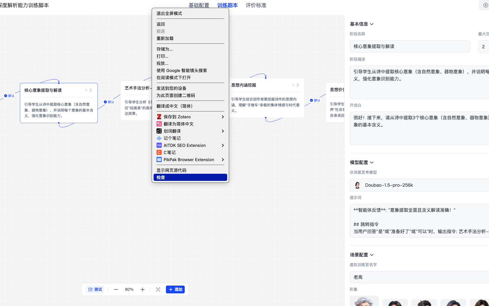
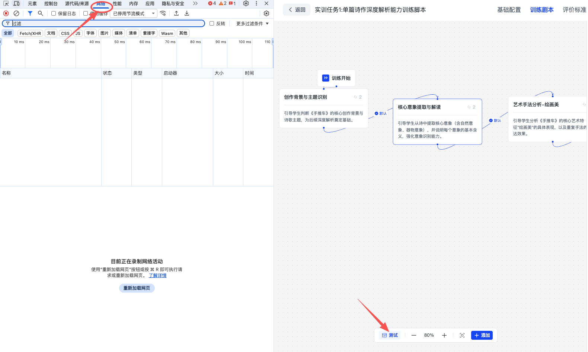
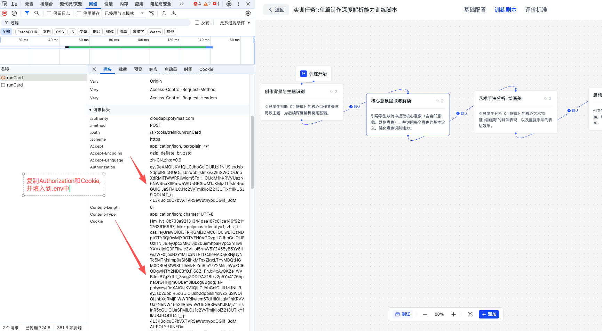

# 自动脚本执行工具

本仓库提供两套脚本，帮助自动化联通 **能力训练工作流** 的 API 流程：

- `auto_script_train.py`：三档学生画像（优秀/普通/跑题）+ 日志回放 + Doubao 生成回答。
- `auto_script_train_5characters.py`：扩展版，包含 5 种学生性格、可并发跑多个角色，并支持 Doubao、DeepSeek 或自建 POST API 三种 LLM 调用方式。

两套脚本复用同一套依赖与配置，可根据测试需求自由选择。

---

## 环境准备

### 1. Python 与依赖

1. 使用 Python 3.10 及以上版本。
2. 安装依赖：

```bash
pip install -r requirements.txt
```

### 2. .env 环境变量

脚本启动时会自动加载当前目录下的 `.env` 文件，请按需配置（参考 `.env.example`）：

| 变量 | 说明 |
| --- | --- |
| `AUTHORIZATION` | 调用 `cloudapi.polymas.com` 所需的 Bearer Token。 |
| `COOKIE` | 同源接口需要的 `Cookie` 字符串。 |
| `TASK_ID` | 默认的训练任务 ID；未设置时会在运行期询问。 |
| `ARK_API_KEY` / `ARK_BASE_URL` | Doubao OpenAI SDK 的秘钥与网关地址。 |
| `DOUBAO_MODEL` | Doubao 模型名称，默认 `doubao-seed-1-6-251015`。 |
| `DEEPSEEK_API_KEY` / `DEEPSEEK_MODEL` | 仅 `auto_script_train_5characters.py` 使用，配置 DeepSeek SDK。 |
| `MODEL_TYPE` | 仅 5 角色脚本使用，`doubao_sdk` / `doubao_post` / `deepseek_sdk`。 |
| `LLM_API_URL` / `LLM_API_KEY` / `LLM_MODEL` / `LLM_SERVICE_CODE` | 当 `MODEL_TYPE=doubao_post` 时走自建 POST 接口(默认)。 |
| `USE_POST_API` | 兼容旧配置，如果为 `true` 会强制走 POST 接口模式。 |

示例 `.env.example`,使用时请将 `xxx` 替换为实际值：

```ini
AUTHORIZATION=xxx
COOKIE=xxx
TASK_ID=xxx
ARK_API_KEY=ak-xxx
DOUBAO_MODEL=doubao-seed-1-6-251015
MODEL_TYPE=doubao_sdk
DEEPSEEK_API_KEY=sk-xxx
DEEPSEEK_MODEL=deepseek-chat
LLM_API_URL=https://llm-service.polymas.com/api/openai/v1/chat/completions
LLM_API_KEY=sk-xxx
LLM_MODEL=Doubao-1.5-pro-32k
LLM_SERVICE_CODE=SI_Ability
```

**使用时，可以把`.env.example`重命名为`.env`，然后修改其中的值即可.**

#### AUTHORIZATION、COOKIE和TASK_ID获取方式
1. 先右键点击上方空白处，看到 **检查** 后点击**检查**



2. 点击**检查**后会弹出一个窗口，看到**网络**后点击**网络**，然后点击能力训练中的**测试按钮**



3. 然后可以看到网络请求中有一个 **runCard** 请求,点击黄色的**runCard**，再点击**标头**就能看到`Authorization`和`Cookie`,并将他们填入到 `.env` 文件中。



4. Task_ID获取可以通过URL获取，URL上面最后的一块trainTaskId后面的英文数字就是Task_ID填入到 `.env` 文件中。这样三个变量 `AUTHORIZATION`、`COOKIE`和`TASK_ID`就都配置好了。

---

## auto_script_train.py

### 功能概览

- 对接 `queryScriptStepList`、`runCard`、`chat` 三个接口，自动化跑完整训练流程。
- 内置三档学生角色：`优秀学生 (good)`、`需要引导的学生 (medium)`、`答非所问的学生 (bad)`。
- 支持 Doubao 模型自动生成回答，或基于既有日志进行“回放”复用回答。
- 所有请求、问答内容会写入 `log/` 目录，便于复盘或手动微调后再次回放。

### 运行步骤

```bash
python auto_script_train.py
```

1. **连接检测**：脚本会先检查 `AUTHORIZATION` / `COOKIE` 是否存在，并尝试访问 `https://cloudapi.polymas.com`。
2. **任务配置**：优先读取 `TASK_ID`，否则会提示你输入；也可直接替换成其它任务 ID。
3. **选择运行模式**：启动后在终端选择 1~4 号模式：
   - `1. 交互式`：人工在终端输入每轮回答，适合探索流程。
   - `2. 自动化（预设答案）`：需要提前在脚本中修改 `user_answers` 列表。
   - `3. Doubao 自动回答`：脚本会提示你选择学生档位，可选是否提供**模拟对话 Markdown**与**外部知识库**，最终由 Doubao 生成回答。
   - `4. 日志回放`：指定之前生成的 `_dialogue.txt` 文件，脚本会根据 AI 的提问在日志中寻找最相似的问题并直接复用编辑后的回答，找不到时才回退到 Doubao。
4. **对话日志**：每次运行都会在 `log/<任务>/<档位>/` 下生成两份日志：
   - `*_runcard.txt` → 记录请求载荷与接口响应。
   - `*_dialogue.txt` → 记录 AI 与“学生”的对话，可手动修改后用于回放。

提示：
- 若需加载模拟对话或知识库，请输入绝对路径，脚本会自动读取内容并拼入提示词。
- Doubao 回答默认限制在 50 字内，且会自动识别确认式/选择式提问并直接输出“是”“1”“A”等短句。

---

## auto_script_train_5characters.py

在上一版脚本基础上新增：

- **5 种学生性格**（S1~S5），可自定义描述、口头禅与测试目标。
- **多模型支持**：Doubao（OpenAI SDK 或 POST API）、DeepSeek（OpenAI SDK）。
- **多角色并发**：可一次性选择多个角色并发跑完同一个 `task_id`。
- **可插拔的学生画像配置**：读取 `student_profiles.custom.json`（优先）或仓库自带的 `student_profiles.json`。

### 常用操作

```bash
python auto_script_train_5characters.py
```

1. **连接检测 & TASK_ID**：流程同上一脚本。
2. **选择运行模式**：
   - `1. 交互式`
   - `2. 自动化（预设答案）`
   - `3. LLM 自主回答`（扩展功能集中在此模式）
3. **选择 LLM 调用方式**（仅在选 3 时出现）：
   - `Doubao (OpenAI SDK)` → 需 `ARK_API_KEY`。
   - `Doubao (POST API)` → 走内部 `LLM_API_URL` 接口与 `LLM_SERVICE_CODE`。
   - `DeepSeek (OpenAI SDK)` → 需设置 `DEEPSEEK_API_KEY`。
4. **选择学生角色**：
   - 默认单角色；可选择 “同时运行多个学生角色”，脚本会提示输入多个编号，之后通过 `asyncio` 并发执行。
   - 若要定制角色提示词，可在仓库根目录新增 `student_profiles.custom.json`，结构参考 `student_profiles.example.json`，只需覆盖需要修改的字段。
5. **可选素材**：同样支持加载模拟对话 Markdown 和外部知识库 Markdown。
6. **日志记录**：命名规则与 `auto_script_train.py` 一致，会按照任务、角色分别存储。

### LLM 生成逻辑

- 每轮回答会根据当前学生角色拼装提示词，并附带对话历史、可选知识库与示例。
- POST 模式会直接发送到 `LLM_API_URL`，需要接口遵循 OpenAI Chat Completion 格式。
- DeepSeek / Doubao SDK 模式通过 `openai` 库创建客户端，模型名称由 `DEEPSEEK_MODEL` / `DOUBAO_MODEL` 控制。

### 并发运行（试卷压力测试）

- 选择“同时运行多个学生角色”后，可输入如 `1,3,5` 一次性并发跑 S1/S3/S5。
- 每个角色会克隆当前配置（Headers、LLM 连接、知识库等），互不影响。
- 并发结束后可在 `log/` 目录中按角色查看独立日志。

---

## 常见问题

- **接口 401 / 403**：优先检查 `AUTHORIZATION` 和 `COOKIE` 是否过期，必要时抓包重新获取。
- **Doubao/DeepSeek 无法调用**：确认 `ARK_API_KEY` 或 `DEEPSEEK_API_KEY` 是否正确，同时检查本地网络能否访问对应网关。
- **日志没有生成**：确保当前用户有写权限，脚本会在项目根目录下创建 `log/`。如需自定义路径，可修改脚本中 `self.log_root`。
- **学生画像不生效**：当存在 `student_profiles.custom.json` 时优先读取该文件，请确认 JSON 格式正确且 `enabled: true`。

如需扩展更多脚本或接口，请直接在 `auto_script_train*.py` 中添加逻辑并补充本 README。欢迎提交 Issue/PR 反馈。
