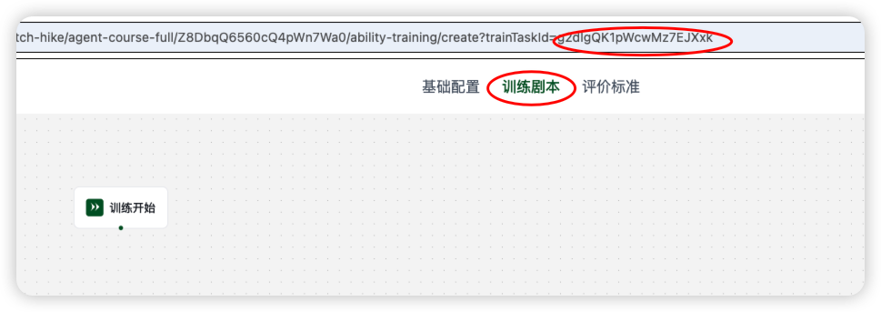
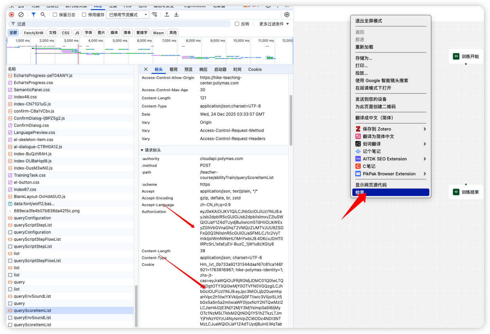
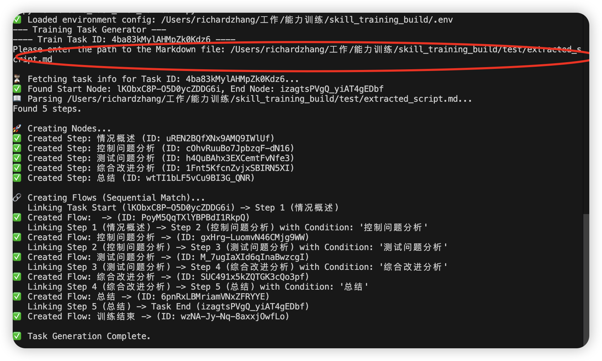
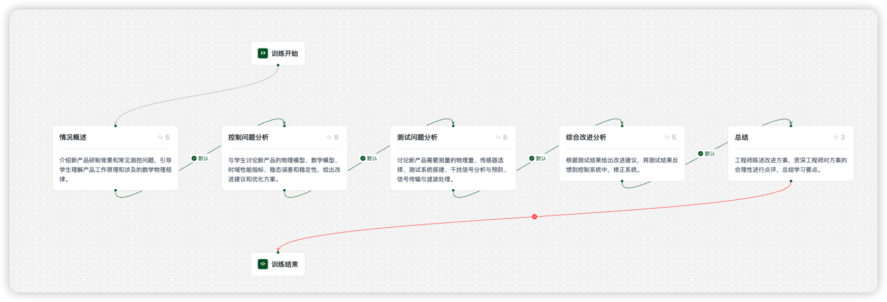

# 技能实训构建工具 (Skill Training Build)

这是一个自动化工具，用于根据 Markdown 文件快速生成能力训练任务（Training Task）的脚本节点（Steps）和流转逻辑（Flows）。

## 核心功能

1.  **解析 Markdown**: 从结构化的 Markdown 文件中读取阶段数据（如提示词、开场白、模型配置等）。
2.  **自动创建节点**: 调用 API 在指定的实训任务（Train Task）中批量创建脚本节点。
3.  **自动构建流程**:
    *   自动识别并连接任务的 **开始节点** 和 **结束节点**。
    *   按照 Markdown 中的顺序，依次连接各个阶段（Step 1 -> Step 2 ...）。
    *   自动设置连线条件（Condition），默认使用下一个阶段的名称。

## 环境准备

1.  确保已安装 Python 。
2.  安装依赖库：
    ```bash
    pip install requests python-dotenv nanoid
    ```
3.  配置 `.env` 文件（在 `skill_training_build` 目录下）：
    ```ini
    AUTHORIZATION=你的Authorization Token
    COOKIE=你的Cookie
    TASK_ID=默认的任务ID 
    ```

## 使用指南

### 1. 准备任务脚本 (Markdown)

请参考 `task_example.md` 的格式编写你的训练脚本。

**关键字段说明：**
*   `### 阶段N: 阶段名称`: 定义一个新的阶段。
*   `**虚拟训练官名字**`: 对应 API 的 `trainerName`。
*   `**模型**`: 对应 `modelId` (例如 `Doubao-Seed-1.6-flash`（默认值）, `Doubao-1.5-pro-256k`)。
*   `**声音**`: (选填) `agentId`，例如 `Tg3LpKo28D`（默认值）。
*   `**形象**`: (选填) `avatarNid`。
*   `**阶段描述**`: 阶段的简短描述。
*   `**互动轮次**`: 设置该阶段的互动轮数。
*   `**开场白**`: 该阶段开始时 AI 的默认发言。
*   `**提示词**`: AI 的系统提示词 (System Prompt)。

### 2. 运行生成脚本

在终端中执行以下命令：

```bash
# 方式 1: 交互式运行 (推荐)
python create_task_from_markdown.py
##填入markdown文件路径，任务ID（可以在环境变量中填写）

# 方式 2: 带参数运行
python create_task_from_markdown.py <markdown文件路径> <任务ID> 
```


### 3. 查看结果

脚本运行成功后，终端会显示创建的节点 ID 和连线情况。请前往平台刷新对应的实训任务页面，最终可以查看生成结果。

## 目录结构

*   `create_task_from_markdown.py`:  核心生成脚本。
*   `task_example.md`:  脚本编写模板。

## AI 语音配置列表

以下是可用的 AI 语音配置，可用于 `**声音**` 字段,默认值是`Tg3LpKo28D`(擎苍)。

| nid | voiceTone | toneType | language |
|-----|-----------|----------|----------|
| Tg2LpKo18D | 灿灿 | 灵动多变，通用情感陪伴～ | 中文 |
| Tg3LpKo28D | 擎苍 | 磁性沉稳，声线百搭专业～ | 中文 |
| Tg4LpKo38D | 反卷青年 | 轻松通透，自带慵懒～ | 中文 |
| Tg5LpKo18D | 古风少御 | 灵动声线，氛围拉满～ | 中文 |
| Tg6LpKo38D | 霸气青叔 | 沉厚如渊，威而不厉~ | 中文 |
| Tg7LpKo48D | 温柔淑女 | 温软如棉，清悦动听~ | 中文 |
| Tg8LpKo58D | 儒雅青年 | 暖声细语，柔而不腻~ | 中文 |
| Tg9LpKo68D | 天才童声 | 清亮机敏，慧黠灵动~ | 中文 |
| Tg0LpKo78D | 奶气萌娃 | 软糯清甜，稚趣盎然~ | 中文 |
| TgaLpKo98D | 温柔小哥 | 温柔问候，治愈陪伴～ | 中文 |
| TgbLpKo08D | Luna | 美式英语女声 | 英文 |
| TgcLpKo88D | Sophie | 美式英语女声 | 英文 |
| TgdLpKo78D | 温暖阿虎/Alvin | 中文,美式英语男声 | 中文及中英文混合场景 |
| TgeLpKo98D | Lucas | 美式英语男声 | 英文 |
| TgfLpKo28D | 爽快思思（多情感） | 中文,英式英语 | 中文及中英文混合场景 |
| TghLpKo58D | Tina老师 | 中文,英式英语 | 中文及中英文混合场景 |


### 使用示例

1. 填写 Markdown 剧本文件,可以参考`task_example.md`

```markdown
### 阶段1: 欢迎介绍
**虚拟训练官名字**: 张老师
**声音**: Tg3LpKo28D  # 擎苍
**形象**: 
**模型**: Doubao-Seed-1.6-flash
**互动轮次**: 1
**开场白**: 同学你好，欢迎来到本课程！
```
2. 获取TaskId、Cookie和Authorization

TaskID获取


Cookie和Authorization获取


将三个填入到 `.env.example`，并将其重命名为`.env`

3. 运行脚本
```bash
python create_task_from_markdown.py 
```


4. 刷新能力训练页面并查看结果
